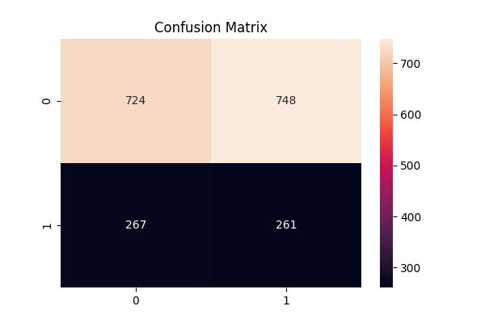

# 📊 Telecom Customer Churn Prediction

## 📌 Problem

Customer churn is a critical issue for telecom companies, as losing customers directly impacts revenue.
The goal of this project is to build a machine learning model that predicts whether a customer is likely to churn.

---

## 📂 Dataset

The dataset contains customer information such as:

* Demographics
* Account details
* Service usage

Target variable:

* **Churn (1 = Yes, 0 = No)**

---

## ⚙️ Approach

### 1. Data Preprocessing

* Handled categorical variables
* Feature transformation
* Train-test split

### 2. Model

* Logistic Regression
* Class imbalance handled using:

  ```python
  class_weight='balanced'
  ```

### 3. Evaluation

* Confusion Matrix
* Classification Report (precision, recall, f1-score)

---

## 📊 Results

The model shows:

* Improved detection of churn customers (recall)
* Trade-off between precision and recall due to class imbalance

Key insight:

> A lower threshold increases churn detection but may lead to overprediction.

---

## 🧠 Business Impact

This model can help companies:

* Identify customers at risk of leaving
* Take proactive retention actions
* Reduce revenue loss

---

## 🛠️ Tech Stack

* Python
* Pandas
* Scikit-learn
* Matplotlib / Seaborn
* Jupyter Notebook

---

## 🚀 Future Improvements

* Implement advanced models (XGBoost)
* Hyperparameter tuning
* Feature engineering

---
## 📊 Confusion Matrix



---

## 📁 Project Structure

* `BankChurn.ipynb` → Main analysis and model
* Dataset file
* README.md

---

## 👤 Author

Daniel Ortiz
